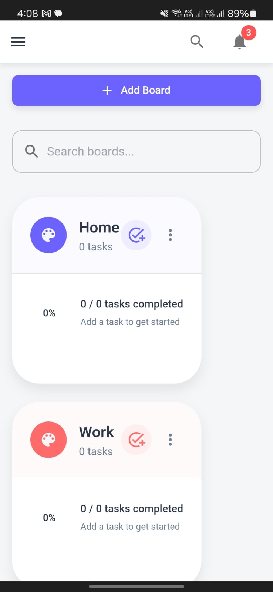

# GoTask


<p align="center">
  
</p>

A modern task management application built with React and Material UI that helps you organize tasks across custom boards, track progress, and boost productivity.

##  Features

- **Task Management**: Create, edit, and delete tasks with titles, descriptions, start/due dates, and priority levels
- **Board Organization**: Group tasks into customizable boards with colors for better visual organization
- **Subtasks**: Break down complex tasks into smaller subtasks and track progress
- **Priority Levels**: Assign low, medium, or high priority with color-coded indicators
- **Date Management**: Set start and due dates for tasks with visual indicators for overdue tasks
- **Filtering & Sorting**: Filter tasks by board, priority, completion status, and date range
- **Advanced Search**: Quickly find tasks with the global search functionality
- **Progress Tracking**: Visual progress indicators for boards and individual tasks
- **Responsive Design**: Clean, modern interface optimized for both desktop and mobile devices
- **Persistent Storage**: Data saved to browser's localStorage for seamless continuity
- **Customizable Themes**: Boards with custom color themes for visual organization
- **Quick Actions**: One-click task completion, editing, and deletion

## 🛠️ Technology Stack

- **Frontend**: React, React Router
- **State Management**: Redux Toolkit
- **UI Components**: Material UI v7
- **Date Handling**: date-fns
- **Build Tool**: Vite
- **Styling**: Emotion (MUI's styling solution)

##  Prerequisites

- Node.js 18+ and npm


##  Usage Guide

### Task Management

- **Creating Tasks**: Click "New Task" button in the header to create a new task
- **Editing Tasks**: Click on the edit icon on any task card
- **Completing Tasks**: Click the checkbox next to task title
- **Deleting Tasks**: Click the delete icon on any task card

### Board Management

- **Create a Board**: Go to "Boards" page and click "Add Board"
- **Customize Boards**: Choose custom colors for visual organization
- **Add Tasks to Boards**: Select the board when creating a task, or use the "+" icon in board view
- **View Board Tasks**: Click on a board to see all associated tasks

### Filtering and Searching

- **Task Filters**: Use the filter button to filter by status, board, priority, and date range
- **Search**: Click the search icon in the header to search tasks by title or description
- **Sorting**: Sort tasks by due date, priority, or progress

### Task Details

- **Due Dates**: Set and track due dates with visual indicators for overdue tasks
- **Priorities**: Assign low, medium, or high priority with color coding
- **Subtasks**: Create and manage subtasks for more complex to-dos
- **Progress Tracking**: Monitor task and board completion with progress bars

##  Project Structure

```
gotask/
├── public/            # Static assets
├── src/
│   ├── components/    # React components
│   │   ├── Board.jsx         # Board management view
│   │   ├── Layout.jsx        # App layout with navigation
│   │   ├── TaskForm.jsx      # Task creation/editing form
│   │   ├── TaskList.jsx      # Main task list view
│   │   └── Settings.jsx      # App settings
│   ├── store/         # Redux store configuration
│   │   ├── store.js          # Store setup
│   │   └── taskSlice.js      # Task state management
│   ├── App.jsx        # Main app component
│   └── main.jsx       # Entry point
├── package.json       # Dependencies and scripts
└── vite.config.js     # Vite configuration
```
## Initial Project Setup

### Prerequisites
- Node.js 18+ and npm installed

### Creating a New Project from Scratch

1. Create a Vite React project:
   ```bash
   npm create vite@latest gotask -- --template react
   cd gotask
   ```

2. Install Material UI dependencies:
   ```bash
   npm install @mui/material @mui/icons-material @emotion/react @emotion/styled
   ```

3. Install Redux Toolkit and React-Redux:
   ```bash
   npm install @reduxjs/toolkit react-redux
   ```

4. Install React Router for navigation:
   ```bash
   npm install react-router-dom
   ```

5. Install date-fns for date handling:
   ```bash
   npm install date-fns
   ```

6. Create basic project structure:
   ```bash
   mkdir -p src/components src/store
   ```

7. Set up Redux store by creating store files:
   ```bash
   touch src/store/store.js src/store/taskSlice.js
   ```

8. Create component files:
   ```bash
   touch src/components/Layout.jsx
   touch src/components/TaskList.jsx
   touch src/components/TaskForm.jsx
   touch src/components/Board.jsx
   touch src/components/Settings.jsx
   ```

## Installation & Setup

### Getting Started with Existing Repository

1. Clone the repository:
   ```bash
   git clone https://github.com/mahilsonowal/GoTask.git
   cd GoTask
   ```

2. Install dependencies:
   ```bash
   npm install
   ```

3. Start the development server:
   ```bash
   npm run dev
   ```
   This will launch the application at http://localhost:5173

### Building for Production

4. Create a production build:
   ```bash
   npm run build
   ```
   This generates optimized files in the `dist` directory

5. Preview the production build locally:
   ```bash
   npm run preview
   ```

## Deployment

### Netlify Deployment

1. Create an account on Netlify if you don't have one
2. Connect your GitHub repository to Vercel
3. Configure build settings:
   - Build Command: `npm run build`
   - Output Directory: `dist`
   - Install Command: `npm install`
4. Deploy and access the live application  https://go-task-dusky.vercel.app/

### GitHub Pages Deployment

1. Install the GitHub Pages package:
   ```bash
   npm install --save-dev gh-pages
   ```

2. Add these lines to your `package.json`:
   ```json
   "homepage": "https://mahilsonowal.github.io/GoTask",
   "scripts": {
     "predeploy": "npm run build",
     "deploy": "gh-pages -d dist"
   }
   ```

3. Update your `vite.config.js` to include the base path:
   ```javascript
   export default defineConfig({
     base: '/GoTask/',
     // other configuration...
   })
   ```

4. Deploy to GitHub Pages:
   ```bash
   npm run deploy
   ```

5. Application will be available at https://mahilsonowal.github.io/GoTask 


## Screenshots

Add screenshots of your application here to showcase its features. Take screenshots of:

- Main task list view
- Board management view
- Task creation/editing form 
- Mobile responsive views


*The main task list interface with filtering options*


*Custom boards with color-coded organization*


*Task creation form with priority, date and board selection*

.
*Mobile UI*
```


## Key App Features

### Task Organization
Tasks can be organized into custom boards. Each board has its own color theme, making it easy to visually distinguish between different categories of tasks.

### Date Management
Set start and due dates for tasks with an intuitive date picker. Tasks can be filtered by date range to focus on what needs to be done in a specific timeframe.

### Progress Tracking
Visual progress indicators show task completion status at both task and board levels, helping you track progress and stay motivated.

### Responsive Design
The application is fully responsive, working seamlessly across desktop, tablet, and mobile devices with an adaptive layout.


##  Author

Mahil Sonowal

---

